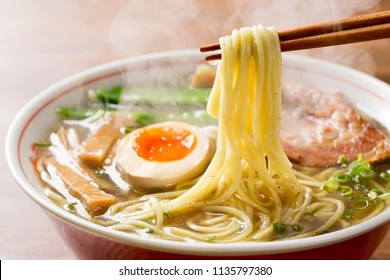
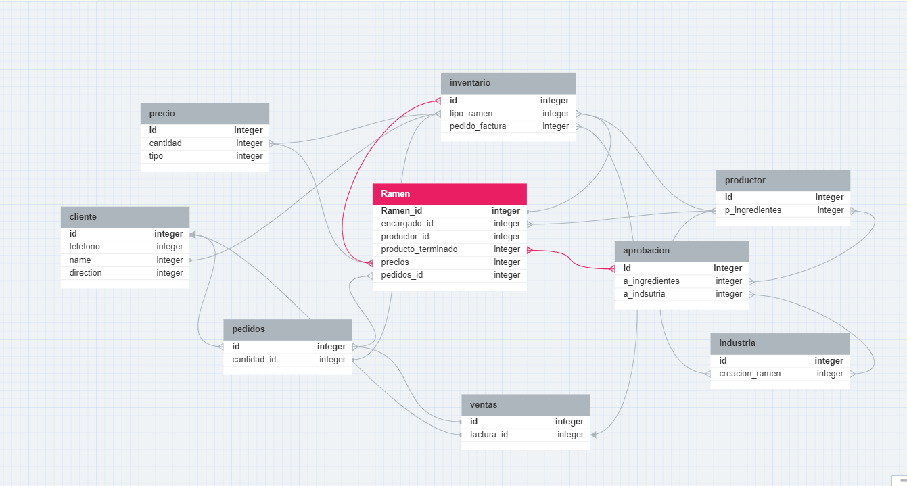

# Sistema de Gestion del Ramen:

### Este sistema de gestión esta basado en una tienda de Ramen para la despensa y comercialización de este.

### El proposito de esta gestión, es la buena organización de los productos.

### Como primera base tenemos este texto introductorio para analizar y comenzar la base de datos

### Este sistema de gestión del ramen:

1 Control de calidad

    El primer paso es establecer un sistema de control de calidad que garantice que los ingredientes y el proceso de elaboración del ramen 
    cumplen con los estándares establecidos. Esto incluye la selección de ingredientes frescos y de alta calidad, la elaboración de un caldo 
    de sabor intenso y la cocción de los fideos al punto.

2 Gestión de inventarios

    Un sistema de gestión de inventarios eficiente ayuda a garantizar que se disponga de los ingredientes necesarios para elaborar el ramen en
    todo momento. Esto evitará la falta de productos y las pérdidas de ventas.

3 Gestión de pedidos

    Un sistema de gestión de pedidos eficaz ayuda a garantizar que los pedidos de ramen se procesen y entreguen de manera oportuna. 
    Esto es importante para satisfacer las necesidades de los clientes y evitar la pérdida de ventas.

4 Gestión de precios

    Un sistema de gestión de precios que sea competitivo ayuda a atraer y retener clientes. Es importante tener en cuenta los costos 
    de los ingredientes, la elaboración y la distribución al establecer los precios.

5 Marketing y publicidad

    El marketing y la publicidad son fundamentales para dar a conocer el ramen y atraer nuevos clientes. Es importante desarrollar una
    estrategia de marketing que se adapte al público objetivo y que destaque las características únicas del ramen.

### Otros tipos de sugerencias para el mejoramiento de la gestión:

	-Desarrollar un sistema de puntuación de los ingredientes para garantizar que se utilicen los mejores productos.
	-Implementar un sistema de seguimiento de la producción para garantizar que el ramen se elabora de manera consistente.
	-Ofrecer cursos de capacitación a los empleados para mejorar sus habilidades en la elaboración del ramen.
	-Crear un programa de fidelización de clientes para incentivar las compras repetidas.

### De este lado estara el codigo de la base de datos :D

Ramen {
	Ramen_id integer pk increments >* inventario.tipo_ramen
	encargado_id integer *>* productor.p_ingredientes
	productor_id integer
	producto_terminado integer > undefined.undefined
	precios integer >* precio.cantidad
	pedidos_id integer *>* pedidos.id
}

productor {
	id integer pk increments
	p_ingredientes integer *>* industria.creacion_ramen
}

industria {
	id integer pk increments
	creacion_ramen integer
}

inventario {
	id integer pk increments *>* Ramen.precios
	tipo_ramen integer *>* productor.p_ingredientes
	pedido_factura integer *> ventas.factura_id
}

aprobacion {
	id integer pk increments *>* Ramen.producto_terminado
	a_ingredientes integer *>* productor.p_ingredientes
	a_indsutria integer *>* industria.creacion_ramen
}

precio {
	id integer pk increments
	cantidad integer *>* inventario.tipo_ramen
	tipo integer
}

pedidos {
	id integer pk increments
	cantidad_id integer >* inventario.tipo_ramen
}

cliente {
	id integer pk increments >* pedidos.id
	telefono integer
	name integer >* inventario.tipo_ramen
	direction integer
}

ventas {
	id integer pk increments >* pedidos.id
	factura_id integer > cliente.id
}

